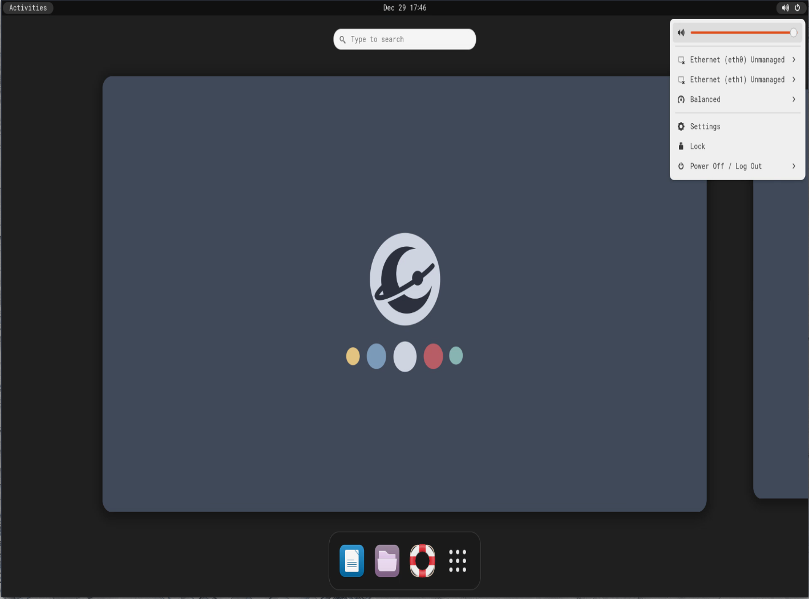

# LaluBuntu

> Prompt: Create a logo with an Evoli-like pokemon for a linux distro named LaluBuntu, make it cute !


> This ansible playbook will make your machine lovely to use.

## This playbook is only intended to be run in `Ubuntu 22.04`

This is my - **@TheLaluka** - own config, shared with the help & motivation of **@Fransosiche** !

- Welcome to my world, `Lower The Friction` between you and your machine!
- See this brief extract of what these scripts will allow you to do
screens/logo-lalubuntu.png

[](https://www.youtube.com/watch?v=xxOVNKNs24s)

## This video is a quick how-to

Note that:

- Around 40GB of free space is needed for a full setup
- The install time will be SIGNIFICANTLY longer for a first run

[](https://www.youtube.com/watch?v=59T4gQICirU)

## Sum-Up

The ansible playbook `main.yml` applies 4 ansible roles which are:

- roles/base-install
- roles/offensive-stuff
- roles/gui-tools
- roles/hardening

## Pre-Install, Install, Update

```bash
# If you ARE A DEV and PLAN TO CONTRIBUTE
# git clone git@github.com:laluka/lalubuntu.git
sudo apt install -y curl wget git vim tmux # Basics
git clone https://github.com/laluka/lalubuntu
sudo mv lalubuntu /opt/lalubuntu
cd /opt/lalubuntu
bash -x pre-install.sh
bash -x install.sh
# Update with
lalupdate
```

## Base install

Base-installs scripts will install all the needed sofware and packages.

1. This ansible script will first update and install a lot of needed packages. You can view all the packages in the `apt-stuff` file in `roles/base-intall/tasks` dir
2. Then, it will install veracrypt (file is `veracrypt-install`)
3. After that, it will setup a directory named DATA (`setup-dir`)(I used it as my workd dir)
4. Then, some configuration of vim will be done (`vim-default`)
5. Docker and docker compose will be installed (`docker-install`)
6. Followed by zsh configuration with customs aliases (`zsh-config`)
7. Then, the script will install rtx because it is so usefull (`rtx-install`)
8. After, the script will use rtx to install several language such as python, java or go (`rtx-all`)
9. Using fresh rust install, the script will install several tools using cargo (`cargo-dl`)
10. A lil' bit of cleanup will be made (`cleanup`)

## Offensive Stuff

Offensive stuff, as the name sounds like, will install all offensive tools (some upgrade could be made tho)

1. First, the script will install some tools using golang (`golang-tooling`)
2. Then, it will install some tools using gem (`gem-tools`)
3. After that, it will install some tools and wordlists from github (`lists_&_tools`)
4. A lil' bit of cleanup will be made (`cleanup`)

## Gui tools

To finish the script, some GUI software such as vscode or office

1. First, it setups every gpg key and repo needed for later use (`setup-for-installs`)
2. Then, it will installs all the gui stuff such as google-chrome, vscode, wireshark... (`install-gui`)
3. Last but not least, it will download and install libreoffice (`install-office`)
4. After, it will install and setup regolith because regolith is GOAT (`setup-regolith`)
5. To finish, some cleanup ! (`cleanup`)

---

## Gotchas

- One can switch between Regolith and Gnome by logging out and picking the desired UI
  - In Gnome: Top-Right corner, then logout
  - In Regolith: CMD+SPACE, then logout





## Improvements & Contributions Ideas

- [] Dragon | https://github.com/mwh/dragon
