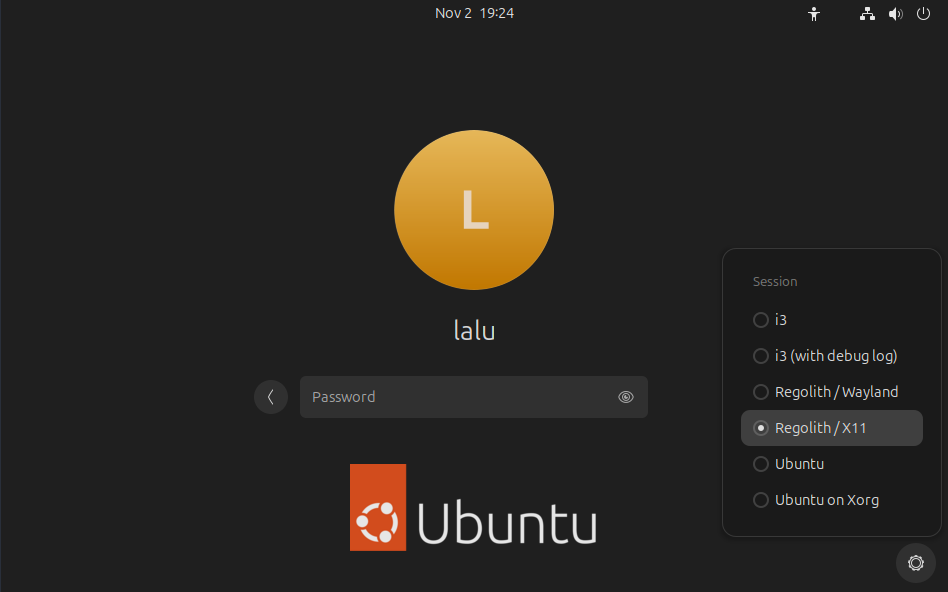

# LaluBuntu - [](https://github.com/laluka/lalubuntu/actions/workflows/packer.yml)

> OpenAI Image Prompt:\
> Create a logo with an Evoli-like pokemon for a linux distro named LaluBuntu, make it cute!


- This ansible playbook will make your machine lovely to use.
- This is my ([@TheLaluka](https://x.com/TheLaluka)) own config, shared with the help & motivation of [@Fransosiche](https://x.com/Fransosiche)!
- Welcome to my world, now is the right time to `Lower The Friction` between you and your machine 🥰

Watch these **videos** to see how Lalubuntu will improve your daily linux & cyber life!


> Here is a **BIG YOUTUBE LOGO** since no one realizes there are video guides and examples to self-onboard.. 🙃

- Global Distro Presentation by [@Fransosiche](https://x.com/Fransosiche) - 14mn
  - [](https://youtu.be/sZQ6FVncuNA)
- HackTheBox Meetup - Lower The Friction by [@TheLaluka](https://x.com/TheLaluka) - 22mn
  - [](https://youtu.be/xxOVNKNs24s)
- Frozenk - Talk Lalubuntu avec [@TheLaluka](https://x.com/TheLaluka) - 1h talk 55mn Q&A
  - [](https://youtu.be/xSmuPUJd9hg)

## Installation process for `Ubuntu 24.04`  - The current "GOLD path" 🌷

```bash
# Pre-install
sudo apt update && sudo apt install -y curl wget git vim tmux
git clone https://github.com/laluka/lalubuntu
sudo mv lalubuntu /opt/lalubuntu
cd /opt/lalubuntu
bash pre-install.sh

# Main Install
bash install.sh 2>&1 | tee /tmp/lbt.log
# If anything fails, the install won't be complete (ansible StopOnFail intended behavior)
# So you'll have to fix (or commment) the failing task and re-run install.sh!
```

Then [pick "Regolith X11"](#gotchas) from lightdm, see screen below

> Stay Up-To-Date by running frequently `lbt-update`! 💌

## If you're migrating from Ubuntu `22.04` to `24.04`

> ⚠️ Seriously, don't do that... ⚠️

- I would **strongly** suggest installing a clean `24.04 Ubuntu Desktop` from the official ISO 🙏
- Then installing Lalubuntu from master 📖
- You *can* try a `dist-upgrate` and running lalubuntu on master, but I've had really poor experiences with `dist-upgrate` in linux in general 🕱
- I will provide no help, the clean way is "Fresh Ubuntu 24.04 then install from master" 😇

> For what it's worth, I tried it and it worked, at some costs!

- Ubuntu update was really long
- Had to run lbt-update from Gnome as regolith broke
- Fix ~/.zrhrc by hand (fix aliases path and lines order)
- A few more hiccups...

You really should NOT go this way, and enjoy a nice and fresh install instead! 🍀

## If you're still on Ubuntu `22.04`

- I won't provide any technical support 🙃
- Run `git checkout 22.04` before installing 🔨
- This branch/tag won't be maintained, but it SHOULD still work for some time 😇

## Here is an install video for convenience

- The install time will be SIGNIFICANTLY longer (1 hour) for a first run
- Around 10G of free space are required for a full install
- I **strongly** recommend **50G** for your VM so it's not full 2 days of use

[](https://youtu.be/59T4gQICirU)

---

## Install Specific Roles Only

- roles/base-install    // CLI Stuff only, make a nice generic purpose install
- roles/offensive-stuff // CLI stuff still, mostly offensive tooling
- roles/gui-tools       // GUI stuff, regolith, wallpaper, and GUI tools

Remember that `gui-tools` and `offensive-stuff` both require `base-install`

```bash
ansible-playbook -vv -i inventory.ini --ask-become main.yml --tags base-install
ansible-playbook -vv -i inventory.ini --ask-become main.yml --tags offensive-stuff
ansible-playbook -vv -i inventory.ini --ask-become main.yml --tags gui-tools
```

## Docker Images

https://hub.docker.com/repository/docker/thelaluka/lalubuntu/general

Available Tags are: `pre-install`, `base-install`, `offensive-stuff`, `gui-tools` == `latest`

```bash
# LOCAL SSH
docker run --rm -it --name lbt -p 2222:22 -d thelaluka/lalubuntu:offensive-stuff
docker exec -it lbt bash -c 'echo hacker:offenskill | chpasswd && /etc/init.d/ssh start'
ssh -p 2222 hacker@127.0.0.1

# LOCAL SHELL & GUI apps
docker run --rm -it --name lbt -u hacker -w /home/hacker -e DISPLAY -v /tmp/.X11-unix/:/tmp/.X11-unix/ --net=host --privileged -d thelaluka/lalubuntu:latest
docker exec -it lbt meld /etc/passwd /etc/group /etc/subuid # Simple 3-way visual diff
```

## Docker Images - Custom Builds

```bash
# Installing packer with mise-en-place
mise use -g packer@latest
# Build Docker Layers
cd /opt/lalubuntu && packer init packer/lbt-docker-branches.pkr.hcl
PACKER_LOG=1 PACKER_LOG_PATH="/tmp/pocker-$(date).log" packer build -only="lbt-pre-install.docker.lbt" packer/lbt-docker-branches.pkr.hcl
# docker run --rm -it --entrypoint /bin/bash -u root thelaluka/lalubuntu:pre-install -il
PACKER_LOG=1 PACKER_LOG_PATH="/tmp/pocker-$(date).log" packer build -only="lbt-base-install.docker.lbt" packer/lbt-docker-branches.pkr.hcl
# docker run --rm -it --entrypoint /bin/zsh -u hacker -w /home/hacker thelaluka/lalubuntu:base-install -il
PACKER_LOG=1 PACKER_LOG_PATH="/tmp/pocker-$(date).log" packer build -only="lbt-offensive-stuff.docker.lbt" packer/lbt-docker-branches.pkr.hcl
# docker run --rm -it --entrypoint /bin/zsh -u hacker -w /home/hacker thelaluka/lalubuntu:offensive-stuff -il
PACKER_LOG=1 PACKER_LOG_PATH="/tmp/pocker-$(date).log" packer build -only="lbt-gui-tools.docker.lbt" packer/lbt-docker-branches.pkr.hcl
# Then refer to "Usage"
```

## Packer - Digital Ocean

> This will use your account to build the image, snapshot it, and allow easy & fast deploy, single or fleet!

```bash
# Installing packer with mise-en-place
mise use -g packer@latest
cd /opt/lalubuntu/packer && packer init lbt-digitalocean.pkr.hcl
# export DIGITALOCEAN_ACCESS_TOKEN=xxxxxxxxxxxxxxxxxxxxxxxxxxxxxxxxxxxxxxxxxxxxxxxxxxxxxxxxxxxxxxxx
PACKER_LOG=1 PACKER_LOG_PATH="/tmp/pocean-$(date).log" packer build lbt-digitalocean.pkr.hcl
# Then visit https://cloud.digitalocean.com/images/snapshots/droplets & create your droplet from the last SnapShot! :)
export DO_IP=X.X.X.X
ssh "root@$DO_IP" systemctl start nxserver.service # Enable Nomachine
ssh "root@$DO_IP" "echo hacker:offenskill | chpasswd" # Set your password (here "offenskill")
ssh -vNL 127.0.0.1:4000:127.0.0.1:4000 "root@$DO_IP" # Add port forwarding to use NoMachine without net exposure
# If you have "No Display" errors
ssh "root@$DO_IP" systemctl restart nxserver.service
# Locally, start NoMachine and connect with:
# hacker:offenskill@127.0.0.1:4000
# Remember to:
#  - NoMachine -> TopRight corner -> Input -> Grab Keyboard Input (for i3 bindings)
#  - RemoteHost -> MOD+space (Settings) -> Set resolution to 1920x1080
#  - RemoteHost -> Mod+enter (Shell) -> lbt-keyboard-layout fr
# ~ Enjoyyyy ~
```

- If you just want to try it quick at no cost
  - Feel free tu use my referal link: https://m.do.co/c/8f065e035836
    - You earn 200$ credit to be used within two months
    - I (lalu) save 25$ on my next infra bill, which is nice!
    - Thank you 🌹

---

## Lalubuntu Actual Content

- **Base-installs** scripts will install all the needed sofware and packages
  - This ansible script will first update and install a lot of needed packages. You can view all the packages in `default_packages` variable in `roles/base-install/defaults/main.yml` file
  - Then, it will install and configure zsh (file is `zsh-config`)
  - Then, the script will install mise (former RTX) and mise packages (`mise-all`)
  - After, finishing the configuration of zsh with mise-en-place (file is `zsh-config-post-mise`)
  - After that, it will setup a directory named DATA (`setup-dir`)(I used it as my work dir)
  - Then, some configuration of vim will be done (`vim-default`)
  - Docker and docker compose will be installed (`docker-install`)
  - Using fresh rust install, the script will install several tools using cargo (`cargo-dl`)
  - A lil' bit of cleanup will be made (`cleanup`)
- **Offensive Stuff**, as the name sounds like, will install all offensive tools (some upgrade could be made tho)
  - First, the script will install some tools using golang (`golang-tooling`)
  - After that, it will install some tools and wordlists from github (`wordlists-and-tools`)
  - A lil' bit of cleanup will be made (`cleanup`)
- **GUI** softwares such as vscode or office will be installed
  - First, it installs common GUI softwares `install-gui-tools` (wireshark, vlc, obs...) (you can find all the packages in `gui_tools_to_install` (`roles/gui-tools/defaults/main.yml`))
  - Then, it will installs google chrome (`install-google-chrome`)
  - Last but not least, it will download and install veracrypt (`install-veracrypt`)
  - Then, install nomachine (`install-nomachine`)
  - Then, install discord (`install-discord`)
  - Then, install vscode (`install-vscode`)
  - Then, install signal (`install-signal`)
  - After, it will install and setup regolith because regolith is GOAT (`setup-regolith`)
  - To finish, some cleanup ! (`cleanup`)

---

## Gotchas

- If you are [lost in regolith](https://regolith-desktop.com/docs/using-regolith/basics/), use `Mod+Shift+?` to open the bindings help panel!
- One can switch between Regolith and Gnome by logging out and picking the desired GUI
  - In Gnome: `Top-Right corner` then logout
  - In Regolith: `CMD+SPACE` then logout
- If you're in a VM, remember to `enable 3D acceleration` which seems required for `24.04` and later





---

## Changelog

```bash
echo "Hello ChatGPT. Learn from my past changelogs and answer OK when you're done learning their format." | cpy # + add the past changelogs
echo -e "Now, generate changelogs for my latest linux distro changesis my git diff output: \n$(git diff origin/master)" | cpy
```

- 2024/11/02
  - Renamed alias from lalupdate to lbt-update in aliases file.
  - Added new alias clean-go to remove Go installation files in aliases file.
  - Removed alias go-reshim from aliases file.
  - Added new alias lbt-keyboard-layout for setting keyboard layout configurations in aliases file.
  - Updated install.sh to include compatibility check for Ubuntu 24.04, with a warning message and exit condition if not met.
  - Added an echo statement in install.sh for additional installation details post-setup.
  - Removed the 'roles/hardening' role application from main.yml.
  - Updated entries in chrome-extensions.lst to ensure accurate version control.
  - Removed vscode-extensions.lst file, transitioning to manual management of VS Code extensions.
  - Updated image references in packer/lbt-digitalocean.pkr.hcl to Ubuntu 24.04.
  - Added a temporary checkout command in DigitalOcean Packer build for Ubuntu 24.04 compatibility in packer/lbt-digitalocean.pkr.hcl.
  - Updated Docker Packer files to use Ubuntu 24.04 images in packer/lbt-docker-branches.pkr.hcl.
  - Updated the execution command in pre-install.sh to streamline script usage.
  - Revised readme.md to include new image guidelines and updated instructional content for new Ubuntu version.
- 2024/05/21
  - Modified aliases file: added safety prompt to cp command using alias cp='cp -i'
  - Updated pre-install.sh: temporarily hardcoded Ansible version to 2.13.12 to avoid bugs in latest 2.13.X with Python 3.8 
  - Added new Go package github.com/sw33tLie/sns@latest to roles/offensive-stuff/defaults/main.yml for latest tools
- 2024/04/18
  - Added asciinema to cargo_tools for shell sessions recording
  - Added okular (pdf edit tool) to GUI tools in roles/gui-tools/defaults/main.yml
  - Updated wallpaper image, let's make the world a cutter place!
- 2024/04/01
  - Updated .github/workflows/packer.yml to add a new GitHub Actions workflow for Packer
  - Modified aliases file: replaced temp alias with tmp, added new aliases aptitall, dpkgi, dkill, paste
  - Added trailofbits.weaudit extension to vscode-extensions.lst
  - Made multiple changes to packer/lbt-docker.pkr.hcl, for github-action daily builds
  - Updated pre-install.sh with DNS settings to use Google's servers
  - Enhanced readme.md with a badge for packer-docker-build and a referral link section
  - Amended roles/base-install/defaults/main.yml with additional packages and general cleanup (size)
  - Modified roles/base-install/tasks/mise-all.yml with new tasks and zsh commands for tool installations
  - Updated roles/gui-tools/defaults/main.yml with new gui tools to install, such as dunst
  - Altered roles/gui-tools/tasks/install-nomachine.yml to handle NoMachine URL extraction
  - Adjusted roles/gui-tools/tasks/setup-regolith.yml with new Xresources configurations
  - Updated roles/offensive-stuff/defaults/main.yml by modifying the lists for go_packages, git_repositories, and removing some entries
- 2024/02/28
  - Enhanced aliases file with additional aliases: sudo-alias trick, b for bat, v for nvim, p for python, and dps for docker ps
  - Modified sysdig alias in aliases for improved Docker container handling
  - In packer/create-user.sh, removed password setting for user hacker and added hacker to sudo group
  - Added new Packer configuration files lbt-digitalocean.pkr.hcl and lbt-docker.pkr.hcl for building DigitalOcean and Docker images
  - Updated pre-install.sh script with apt-get clean and package installation changes
  - Revised readme.md with detailed Packer usage instructions for Docker and DigitalOcean, including environment setup and build commands
  - Modified roles/base-install/defaults/main.yml by removing bat from default_packages and adding it to mise_tools
  - Updated roles/base-install/tasks/default-packages.yml to check for and disable Ubuntu Pro ESM spammy messages
- 2024/02/26
  - Updated readme.md with section "Install Specific Roles Only" with previous tag addons
  - Removed trash-cli from base-install default packages and added latest install via pipx
  - Added meld and tmate to base-install default packages
  - Added duf, neovim, websocat to mise_tools in base-install
  - Added task to disable Ubuntu Pro ESM spammy messages in base-install
  - Added download and executable setting tasks for fastgron in base-install
  - Included neovim install and config tasks in base-install aliased on v
  - Slightly reworked and unified variable use
  - Updated gui-tools tasks for cameractrls and nomachine with various fixes
  - Allow nomachine install to fail, they often make breaking changes to the install process
  - Updated offensive-stuff go_packages and git_repositories lists
- 2024/02/24
  - Created .gitignore with patterns for lalubuntu.tar, *.log, *.pem, .env
  - Added clean-crash alias to remove files from /var/crash
  - Refactored roles in main.yml with tags for organization (base-install, offensive-stuff, gui-tools, hardening)
  - Added user creation script create-user.sh for user hacker with temp sudo privileges for install time
  - Implemented Packer configuration do-lalubuntu.pkr.hcl for Docker Imge and DigitalOcean snapshot creation
  - Updated readme.md with Packer instructions, and additional tools to install
  - Fixed mise sometimes not being loaded & removed xrandr unused aliases
  - Implemented security measures and cleanup in Packer build process
- 2024/01/12
  - Added a new alias: yt-dlp
  - Created vscode-extensions.lst for VS Code extensions
  - Added auto completion for a few kube/terraform related tools
  - Added gnome-tweaks, blueman, obs-studio from the official ppa
  - Added lalutools pty4all, pypotomux, broneypote, bypass-url-parser
  - Added bindsym for sound settings
- 2024/01/06
  - Renamed rtx to mise-en-place
  - Added a changelog section to readme.md
